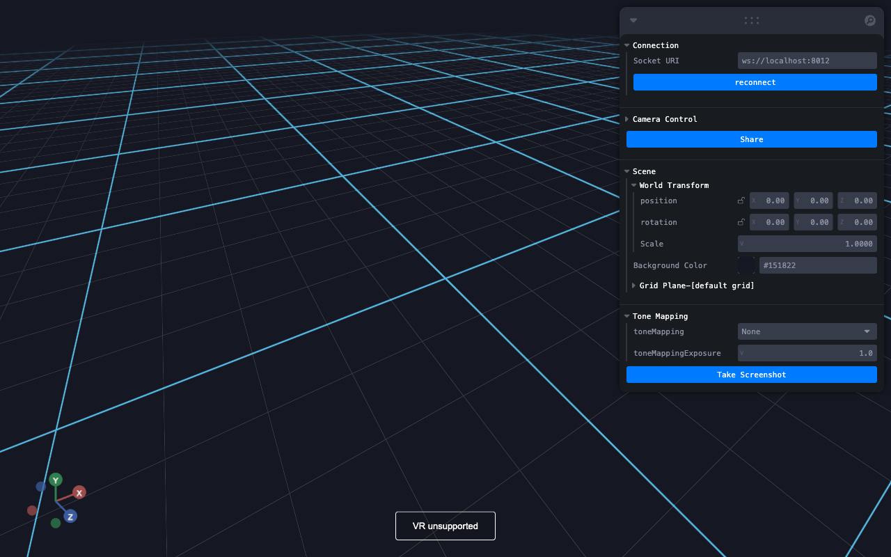

# Vuer Headless Render Example

This is an example of how to use vuer to render a scene in headless mode.
Although we provide a vuer script, you should be able to use any vuer script
with this setup. Just change the url in the [src/index.ts](src/index.ts) file.



## Setup

1. First install `node` through `nvm`.
2. Install `yarn`
3. Install yarn and typescript globally, and tslint
    ```shell
    npm install -g yarn typescript tslint
    ```
4. now in project root run
    ```shell
    yarn
    ```
   This should install the needed modules under `node_modules`
5. For the python example, install vuer (v0.0.22)
    ```shell
    pip install vuer==0.0.22
    ```

## To Run the Example

The example contains two scripts: a python script for launching the vuer server
which also fires the rendering requests, and a puppeteer script that launches
chrome in headless model, with GPU acceleration turned ON, to render the scene.

On macs we use the `gl` mode `angle`. On Linux, you might want to use `egl` 
instead. I have not tested that.

run:
```shell
python python/vuer_example.py
```
then in a different shell run
```shell
yarn start
```
or
```shell
ts-node src/index.ts
```

To test if webgl is enabled, use puppeteer to visit `https://use.webgl.org`.

## Known Issues

**Low frame rate**: The frame rate is low for grabbing rendered images from the default
camera. Not sure why.

**Puppeteer `waitFor...` trigger not idea**: I am currenting using a leva className
as the trigger, but this is not idea. Need to find a better way to identify page 
and app load.
